# The Pharmaceutical Sales Process

Understanding the journey from sales rep to prescription

---
layout: default
---

# Step 1: The Sales Visit

```mermaid
graph LR
    A[👨 Pharma Rep] -->|Visits| B[👨‍⚕️ Doctor]
    B -->|Learns about| C[💊 Medicine]
```

- Pharmaceutical representative visits doctor's office
- Presents clinical data and benefits
- Provides samples and educational materials

---
layout: default
---

# Step 2: Doctor's Decision Process

```mermaid
graph TD
    A[👨‍⚕️ Doctor] -->|Evaluates| B[Clinical Data]
    A -->|Considers| C[Patient Needs]
    A -->|Reviews| D[Treatment Options]
    B --> E[Decision]
    C --> E
    D --> E
```

---
layout: default
---

# Step 3: Patient Visit

---
layout: default
---

# Step 4: Pharmacy Fulfillment

```mermaid
graph LR
    A[👤 Patient] -->|Brings Rx to| B[💊 Pharmacy]
    B -->|Verifies| C[Insurance]
    B -->|Checks| D[Stock]
    C -->|Approved| E[Fill Rx]
    D -->|Available| E
    E -->|Ready| A
```

---
layout: center
class: text-center
---

# Complete Process Overview

```mermaid
graph LR
    A[👨 Pharma Rep] -->|Educates| B[👨‍⚕️ Doctor]
    B -->|Later Sees| C[👤 Patient]
    C -->|Gets Rx| D[📝 Prescription]
    D -->|Takes to| E[💊 Pharmacy]
    E -->|Fills| F[Medicine]
    F -->|Receives| C
```

---
layout: end
---

# Thank You

Understanding the complete pharmaceutical sales cycle